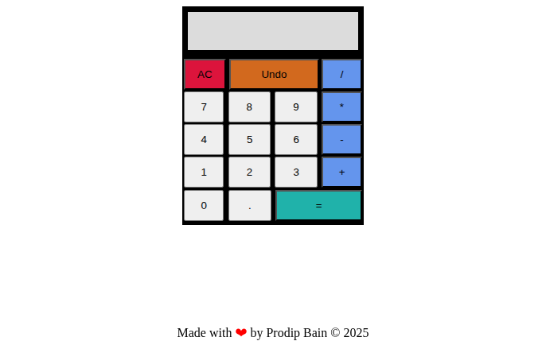

# Calculator App

A simple, responsive calculator built with HTML5, CSS3, and JavaScript. It performs basic arithmetic operations and is designed with clean UI and functional logic.

## [Live Demo](https://pbain63.github.io/Project_calculator/)

---

## Screenshot

| Mobile View                           |
| ------------------------------------- |
|  |

---

## Features

- Addition, subtraction, multiplication, and division
- Clear button to reset input
- Decimal number support
- Error prevention (e.g. double operators, multiple decimals)
- Responsive design for mobile and desktop

---

## Built With

- HTML5
- CSS3
- JavaScript (Vanilla JS)

---

## Getting Started (For Developers)

To run this project locally:

1. Clone the repository:

   ```
   git clone https://github.com/pbain63/Project_calculator.git
   ```

2. Navigate to the project directory:

   ```
   cd Project_calculator
   ```

3. Open `index.html` in your browser

You can also open the file directly in VS Code or any code editor.

---

## Future Improvements (Optional Ideas)

- Add history of calculations

- Improve error handling

- Add keyboard input support

- Create scientific calculator features (sin, cos, log, etc.)

---

## Author

#### Prodip Bain

[GitHub](https://github.com/pbain63)

Email: prodipbain63@gmail.com

---

## License

This project is open-source and available under the MIT License.

---
